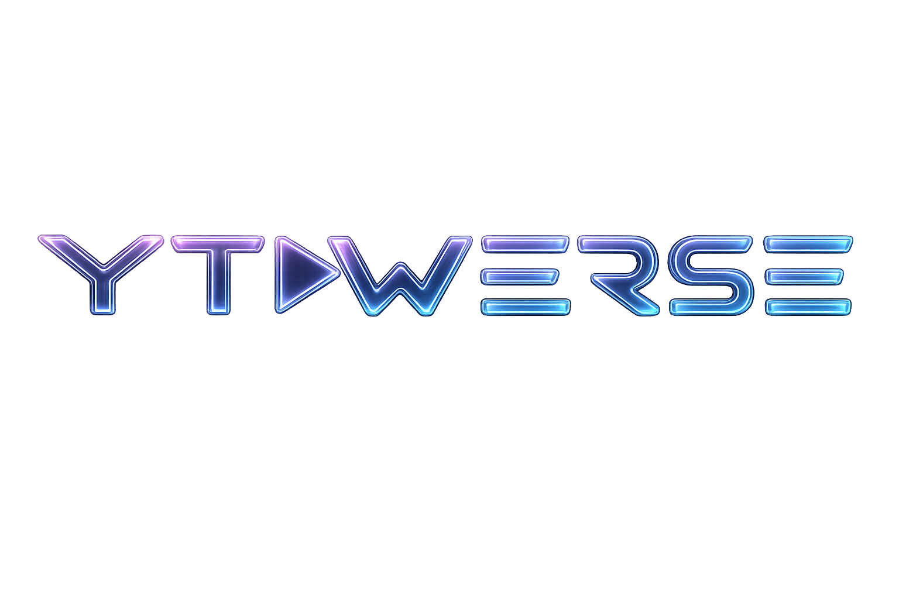
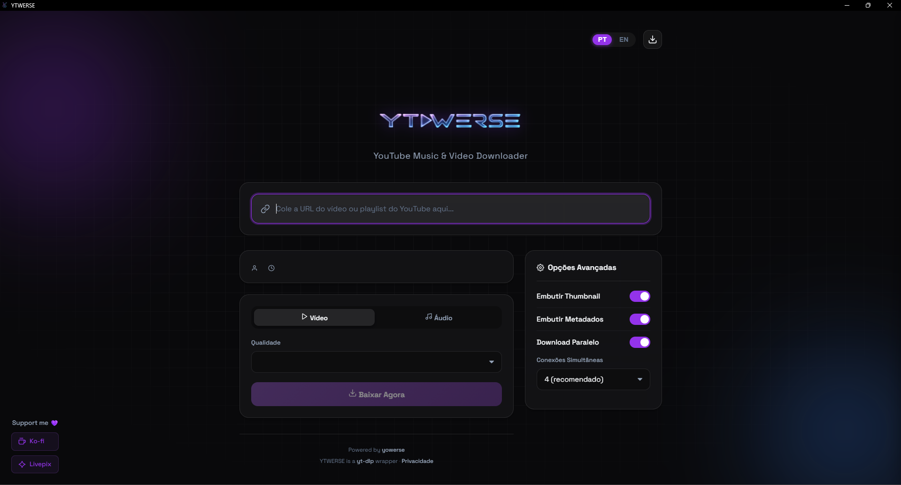
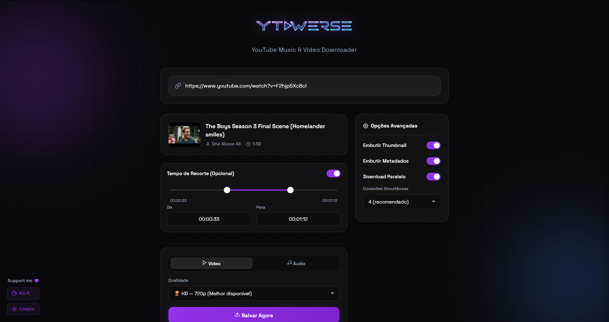
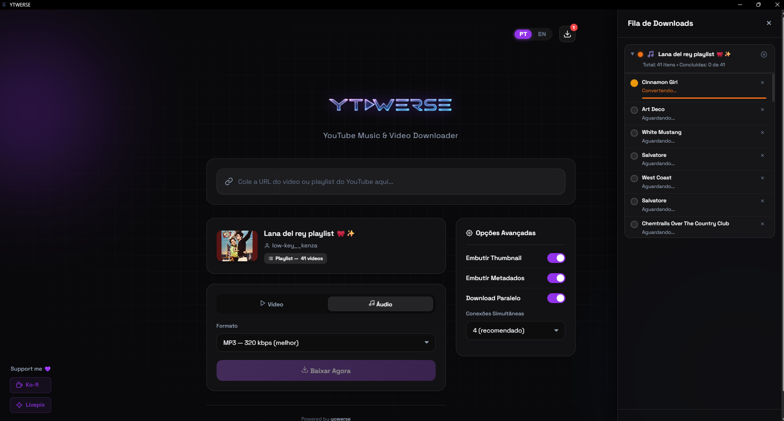

<div align="center">
  
  
  <h3>YouTube Music & Video Downloader</h3>
  
  <p>Uma interface desktop incrivelmente elegante e moderna para o poderoso <b>yt-dlp</b>.</p>
  <p><i>An incredibly elegant and modern desktop interface for the powerful <b>yt-dlp</b>.</i></p>

  <p>
    
    
    
    
  </p>
  
  <p>
    <a href="#-visão-geral">Português</a> • 
    <a href="#-overview">English</a>
  </p>

  <br>

  <div>
    
    
    
  </div>
</div>

---

## 🇧🇷 Português

### ✨ Visão Geral

O **YTWERSE** é a ponte perfeita entre a potência brutal do *yt-dlp* (linha de comando) e a comodidade visual de uma aplicação desktop moderna. Com uma interface polida utilizando design Glassmorphism e Dark Mode nativo, o aplicativo permite baixar vídeos, áudios e playlists completas do YouTube com apenas alguns cliques, sem precisar tocar em nenhum código.

### 🚀 Funcionalidades

- **Download de Vídeos em Alta Qualidade:** Baixe conteúdos em MP4 (1080p, 720p, 480p, etc).
- **Extração de Áudio Nativa:** Baixe músicas em MP3 (Alta qualidade 320k) ou M4A.
- **Suporte a Playlists:** Cole o link de uma playlist e acompanhe o progresso de cada item individualmente!
- **Feedback em Tempo Real:** Animações fluidas, estimativa de tempo (ETA), velocidade de download e barras de progresso via *Server-Sent Events*.
- **Opções Avançadas:** Embutir metadados, anexar a capa (thumbnail) diretamente no arquivo MP3, e configurar conexões simultâneas para downloads ultra rápidos.
- **Gestão Automática de Dependências:** O próprio aplicativo baixa e atualiza o `yt-dlp` e o `FFmpeg` nos bastidores de forma invisível.

### 📥 Como Baixar (Apenas o Aplicativo)

A forma mais fácil de utilizar o YTWERSE é baixando apenas o executável pré-compilado, sem precisar baixar o código inteiro:

[](https://github.com/WillSttos/ytwerse/raw/main/dist/YTWERSE.exe)

1. Clique no botão acima para baixar o arquivo `YTWERSE.exe` diretamente.
2. Dê um duplo-clique para abrir (Não é necessário instalar nada!).
3. Na primeira inicialização, ele fará o download seguro do `FFmpeg` e `yt-dlp` silenciosamente.

> **⚠️ IMPORTANTE: Falso Positivo do Antivírus / Windows Defender**
> 
> Como o `YTWERSE.exe` foi compilado utilizando o *PyInstaller* e empacota um servidor local sem uma assinatura digital paga (Certificado EV), **é muito comum que o Windows Defender ou navegadores o alertem como arquivo suspeito** (falso positivo).
> 
> **O aplicativo é 100% seguro, de código aberto, e você mesmo pode inspecionar o código aqui no GitHub.**
> 
> **Como permitir a execução:**
> * No Windows Defender, ao aparecer a tela azul "O Windows protegeu o seu computador", clique em **Mais informações** e depois em **Executar assim mesmo**.
> * Caso o antivírus bloqueie o arquivo, adicione-o na aba de exclusões ou compile-o você mesmo a partir do código-fonte.

### 🛠️ Como Compilar a partir do Código-Fonte

Caso prefira rodar ou compilar o projeto você mesmo, siga os passos:

1. Clone o repositório:
```bash
git clone https://github.com/WillSttos/ytwerse.git
cd ytwerse
```

2. Instale as dependências:
```bash
pip install -r requirements.txt
```

3. Rodar em modo de desenvolvimento:
```bash
python launcher.py
```

4. Compilar o seu próprio `.exe`:
```bash
# Rode o script fornecido
.\build.bat
```
*(O executável será gerado dentro da pasta `dist/`)*

---

## 🇺🇸 English

### ✨ Overview

**YTWERSE** is the perfect bridge between the raw power of *yt-dlp* (command-line) and the visual convenience of a modern desktop application. With a polished interface using Glassmorphism design and native Dark Mode, the app allows you to download videos, audio tracks, and full playlists from YouTube with just a few clicks, without needing to touch any code.

### 🚀 Features

- **High-Quality Video Downloads:** Download content in MP4 format (1080p, 720p, 480p, etc).
- **Native Audio Extraction:** Download music in MP3 (High quality 320k) or M4A.
- **Playlist Support:** Paste a playlist link and track the progress of each item individually!
- **Real-Time Feedback:** Fluid animations, estimated time of arrival (ETA), download speed, and progress bars via *Server-Sent Events*.
- **Advanced Options:** Embed metadata, attach thumbnails directly to the MP3 file, and configure simultaneous connections for ultra-fast downloads.
- **Automatic Dependency Management:** The app itself downloads and updates `yt-dlp` and `FFmpeg` transparently in the background.

### 📥 How to Download (App Only)

The easiest way to use YTWERSE is to download just the pre-compiled executable, without downloading the entire code:

[](https://github.com/WillSttos/ytwerse/raw/main/dist/YTWERSE.exe)

1. Click the button above to download the `YTWERSE.exe` file directly.
2. Double-click to run (No installation required!).
3. On the first launch, it will safely and silently download `FFmpeg` and `yt-dlp`.

> **⚠️ IMPORTANT: Antivirus / Windows Defender False Positive**
> 
> Because `YTWERSE.exe` was compiled using *PyInstaller* and bundles a local server without a paid digital signature (EV Certificate), **it is very common for Windows Defender or browsers to flag it as a suspicious file** (false positive).
> 
> **The app is 100% safe, open-source, and you can inspect the code yourself right here on GitHub.**
> 
> **How to allow execution:**
> * In Windows Defender, when the blue "Windows protected your PC" screen appears, click **More info** and then **Run anyway**.
> * If your antivirus blocks the file, add it to the exclusions tab or compile it yourself from the source code.

### 🛠️ How to Compile from Source Code

If you prefer to run or compile the project yourself, follow these steps:

1. Clone the repository:
```bash
git clone https://github.com/WillSttos/ytwerse.git
cd ytwerse
```

2. Install dependencies:
```bash
pip install -r requirements.txt
```

3. Run in development mode:
```bash
python launcher.py
```

4. Compile your own `.exe`:
```bash
# Run the provided script
.\build.bat
```
*(The executable will be generated inside the `dist/` folder)*

---

## 📂 Estrutura do Repositório / Repository Structure

* `launcher.py`: Arquivo de inicialização / Initialization file.
* `_app/`: Todo o coração da aplicação / The core of the app.
  * `server.py`: Backend em Flask / Flask Backend.
  * `downloader.py`: A lógica nativa do *yt-dlp* / Native *yt-dlp* logic.
  * `deps_manager.py`: Gerenciador de download do FFmpeg e yt-dlp / FFmpeg and yt-dlp downloader manager.
  * `templates/` e `static/`: O Frontend deslumbrante / The stunning Frontend (HTML/JS/CSS).
* `assets/`: Ícones visuais / Visual icons.
* `dist/`: Onde o executável reside / Where the compiled `.exe` lives.

## 📜 Licença / License

Desenvolvido para fins pessoais e educacionais. Por favor, respeite os Termos de Serviço do YouTube e os direitos autorais ao baixar conteúdo da plataforma.

*Developed for personal and educational purposes. Please respect YouTube's Terms of Service and copyrights when downloading content from the platform.*
